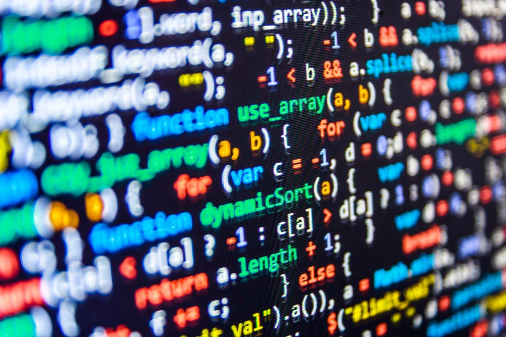

Back in the day when I was in class “intro to computer science II” the assignment score was deducted if the coding standard assigned by the professor was not met in the homework. One small whitespace, explanation of functions, indentation, etc. What I thought at first was, “it is only a style of coding, is not the points getting deducted is too much?”. However, there must be a reason for being strict and making the students get aware of it. Professor would not deduct points for trivial things, the concept of coding standard must be significant.

The coding standards are useful and important. There is a single person-made project in which only the conductor of that program will see the code. However, in a group project, we have to code clearly so that all the members can understand the code. The project should not be delayed due to the coding style. Besides, even if it is a single person project, it is necessary to keep the code with coding standards. It might be confusing even for the one who wrote that code. The problem is worse when the code is passed to another person later on. 

Thus, programming using ESLint was supportive. ESLint pointed out some problems that I did not even notice. Also, I learned some new coding standards I did not know. Using ESLint was better and clear to recognize compared to coding without any additional support. It is always better in keeping with standard coding. Python uses indentation as its syntax! So, it would have to give more effort to keep the standard when using Python. ESLint is great, it will be a great help to future projects.
