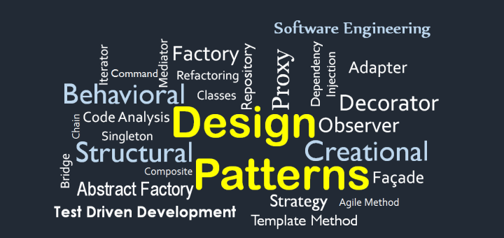

  

    
  
 

Design pattern? The first thing that came to my mind when I saw the word 'design pattern' was some kind of clothing design. Of course, it is a software term, so it cannot be clothing design. I had some research on software design patterns. Research shows that design patterns are solutions that can be used when problems often arise in a particular context when designing software. In other words, when developing various application software systems with different software modules or functions, there are common design problems among each other, and there are also common solutions to deal with them. The advantage of this pattern is that if it is a project involving several team members, it will make communication easier and solve problems faster. 
 
There are 23 types of design patterns in total. Some of them are methods that have been heard or tried in class. The Singleton method is the first design pattern I have ever encountered. At first, I had no idea why I had to use it and what was good about using this pattern. Why don't we just make more objects? Is not making only one object makes things difficult in many situations? However, the Singleton pattern is useful in situations where all the information is in one object, such as a scoreboard. If things get complicated when coding in a singleton pattern, you do not have to use that pattern. The purpose of design patterns is to make problems easier by using patterns that are appropriate for the right situation.
 
I have used the factory method in my previous project. I am not sure whether the pattern I used in the project is the factory method. Many design patterns looked similar to each other. The one I used was to make the value accessible by the user as a function such as getValue, rather than access to the value itself. More research is needed to understand each pattern deeply, and it will be helpful to know all of them for my future group project. I already know the Singleton pattern, so I will just have to look into 22 more.

