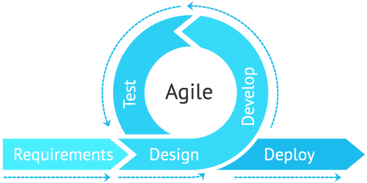

I thought “software engineering” was simply an activity that develops an application. Until now, I was able to write a code for a given problem but did not experience an application-making project ever. In this software engineering class, I was able to learn about how to make an application, and also all those skills needed for software engineers. Two of the most memorable skills I learned are functional programming and agile project management. 

 
### Funtional Programming
First, what is functional programming? The simple answer – programming using a function. We can make this function my own, or we can use the functions that are already available. Its advantage is that they are used to save time and program efficiently by applying them to the same kind of problems. I used functions from the underscore.js library, as well as JavaScript built-in Array functions for the final project.

### Agile Project Management
Next, agile project management is a project management method that divides a large project into smaller, repeatable, manageable chunks. An example of my application of this method was to create milestones 1, 2, and 3. We had intervals of about a week to make and solve the issues needed for each Milestone. Milestone 1 primarily makes page mockups. Milestone 2 made those mockups to be functional. Milestone 3 completes the unfinished functions and the application testing. Simple tasks were made and assigned first, and the complicated tasks were carried out gradually. The huge advantage of this method was that all team members could cooperate at the same time. Each person can only think of his issues, and what else he should work on afterward were organized. Every time I solved my issue, I could see the whole project gaining weight, and I was even pleased to see the application getting close to completion over time.

The two skills above were most memorable because, in my opinion, collaboration and efficiency are essential in software engineering. Large projects are tough to be completed alone. The more people participate, the higher the quality. However, team projects must have clear objectives, and the resulting efficiency and speed of work are crucial to be high quality. I was lucky enough to experience an efficient team project in this class. When I was working on the project, I felt that my skills improved while studying the issues I was in charge of. Further, I will improve my software engineering skills by developing more other projects, and those skills will be used again in the future.
