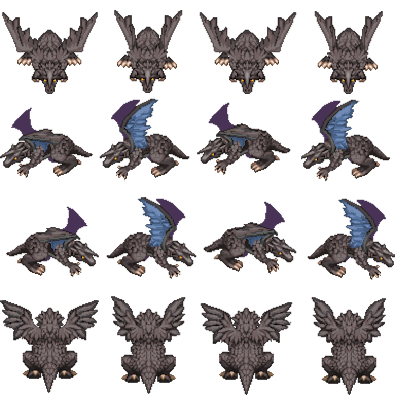
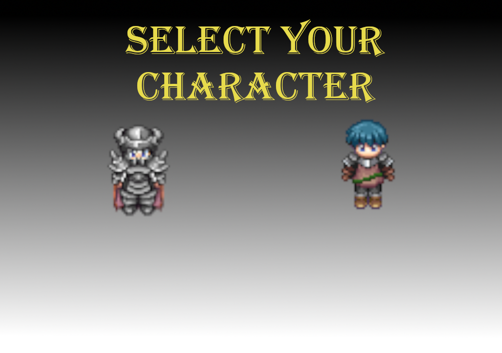

  
  
  
  

This project is a final project what I made for Intro to Computer Science I class with two other group members. We were assigned to make a video game using “EZ.java”, a program used in the course. (“EZ.java” had some functions as initializing a new window, moving the images, etc) Our group decided to make an RPG-style boss raid game using spritesheets that were available on Google. There was two characters, warrior, and mage and each of them had different attack skills to fight with the boss. My role was to design the boss.

I planned to make several attack patterns that occurs randomly. After I made that, I also designed the "rage mode" that will appear when boss's hit point falls below 1/4. Rage mode makes the boss to fall meteorites that cause damage in the sky will drop randomly, and the boss’s attack power and speed increases.

It is the first project I have done since I learned to code, so there is a lot of flaws and difficulties. For example, I did not know what a public static is, but I wrote it in front of the variables and end up creating only one object. So, I had to make eight identical classes which does not meet object-oriented programming. The most memorable moment in the project was the work of combining the team members code into one program. It was more difficult to code than expected, and there were a lot of difficulties. But in the end, we felt the sense of achievement that everyone has created a good result together. 

Source code: <a href="https://github.com/yongu2000/ics111_final"><i class="large github icon"></i>BossRaidGame</a>

[YouTube](https://youtu.be/xtAaX3_R4KQ)
[YouTube2](https://youtu.be/1PNJjIv2vmQ)

