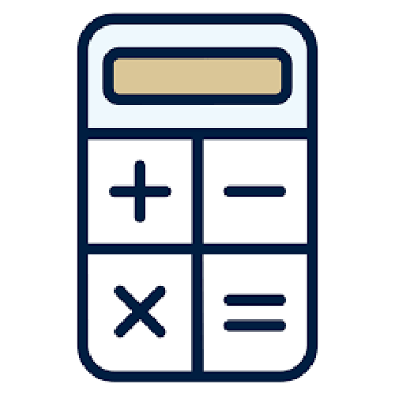

  

This is a simple calculator I made at the end of the first semester to study Python during the winter break. Before this project, I thought that only separate programs such as “EZ.java” could display the GUI, but I realized that Python used “Tkinter” and Java also had “Apt” or “Swing” to display it.

Composed of 0 to 9 digits and + - * / AC = buttons, the appropriate functions are set on 0 to 9, AC  + - * /  = buttons respectively. 0~9 and AC show numbers on the screen. +-*/ receive numbers and put them in a temporary global variable when there is an existing number displayed on the screen. After that, it sends the operator to the calculate global variable. = Button calculates the two numbers according to the operation.

I have heard a lot since I first study programming, “If you want to learn a programming language, you have to learn Python.” The most typical reason is that the code is simple and easy to read and write, so it is easy to learn and suitable for the first programming language. I learned Java, the first programming language, so I had convenience in studying Python.

public class className {
 public static void main(String[] args) {
 } 
}

It was convenient to start coding directly in the blank without the above initial code. 

Python is one of the favorite programming languages among many developers. It also has close relation with IoT(Internet of Things), so it would be worth learning Python. I will keep practice, creating several other projects using Python. My next plan is to make a Tetris game with it.

Source code: <a href="https://github.com/yongu2000/calculator"><i class="large github icon"></i>calculator</a>

