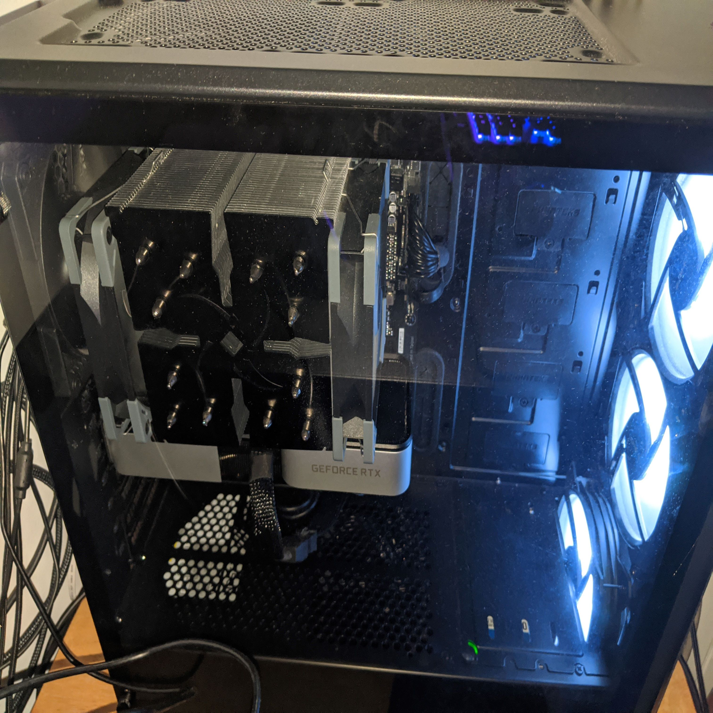

I played video games on console for a majority of my life. Multiple Call of Duty titles on both Xbox and Playstation, Super Smash Bros. Melee on Gamecube, Pokemon on Gambeboy, and even Wii Sports on Wii. I never really ha dthe oppotunity to play video games on a computer because I got the idea from my dad that computers were more work and school oriented whereas consoles were made soley for video games. Seeing as more people were gaming on PC than on console, I decided to make a switch. 

First step was to watch hours of PC building tutorials and image training. Once I got down the idea of how to build it, I needed to decide what to build i.e. what components do I need: Do I want to go AMD or Intel, Radeon or Nvidia, 3200MHz CL16 or 3600MHz CL18 ram, RGB or no RGB? I researched all I could about PC components until I finally went to fill up my shopping cart. 

Building in the middle of a pandemic was hard people wanting to have a machine for themselves. With limited resources and labor, the prices of components increased. And, with the release of a new generation of components, namely Ryzen 5000 series CPUs, Radeon RX 6000 series GPUs, and RTX 3000 series GPUs, and seeing the increase of price to performance compared to the last generation, the demand for components increased as well. I got very lucky getting an RTX 3060 Ti at 5 am, spamming the "Add to cart button" and praying at the same time. 

Building a pc is fun. 

