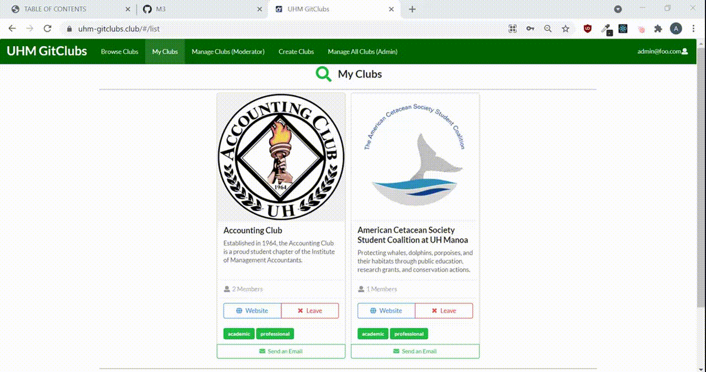
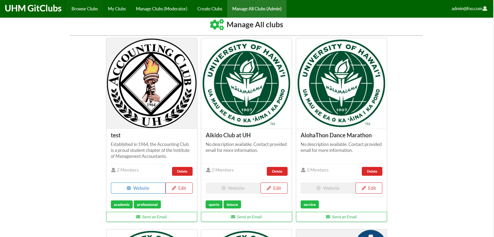

### Landing Page

### Browse Clubs

### My Clubs

### Manage Clubs

### Intro
This project is the final project what I made for ICS314, a software engineering class. There were four other group members, and we were assigned to develop a webpage application using Meteor. The content of the application is to make a club hub that includes all the UHM clubs. The webpage will show all the information about the club and make the user browse for it, and subscribe to the clubs that they like. The project used agile project management, which divides the whole project into three different parts. Milestone 1, 2, and 3. Milestone 1 covered the page mockups, milestone 2 covered the functional part of the application, and milestone 3 to test the application and clean up the unused file.

### My Role
My role for each milestone were in the <a href=https://github.com/uhm-gitclubs/uhm-gitclubs/projects> projects page </a>.

### Conclusion
I was able to learn more about the publications in Meteor while working on my issues. I think the good point of using agile project management is that we can get more deeply into our task, and make a better quality function for that task. I think this project was successful. Our group managed to do all the tasks assigned at the beginning, with no trouble or delay. It was exciting to see the new function made by teammates available when I was done with my function. I hope the other teammates felt that way too.

Source code: <a href="https://github.com/uhm-gitclubs/uhm-gitclubs"><i class="large github icon"></i>Gitclub</a>

Home Page: <a href="https://uhm-gitclubs.github.io/">UHM-GitClub</a>

