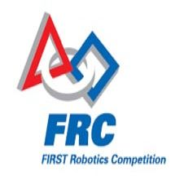

My first school was Puuhale Elementary, and it was not the best school. Being in a shady area, it was kind of hard to feel safe. When I moved at the end of 1st grade, I transfered to Lanakila Elementary, set in a more developed area. Everything felt ordinary; the students felt the same, the teachers felt the same, the food was the same. One day, my math teacher had asked what I wanted to do and I had nothing to say in response. She pointed me towards the robotics team, in the computer lab that I never knew existed. Through robotics team, I made friends that I still talk to to this day and learned not only about programming lego robots but also being somewhat literate with a computer. 

For a particular robotics meet, held at Kalākaua Middle, we had to come up with a solution for the world's issue of pollution. Not only did we have to maneuver through a pollution-style course, we also had to present our solution in front of a panel and that panel gave us a grade that our placement in our meet heavily depended on. Ultimately, we finished 3rd but the whole event was fun.

